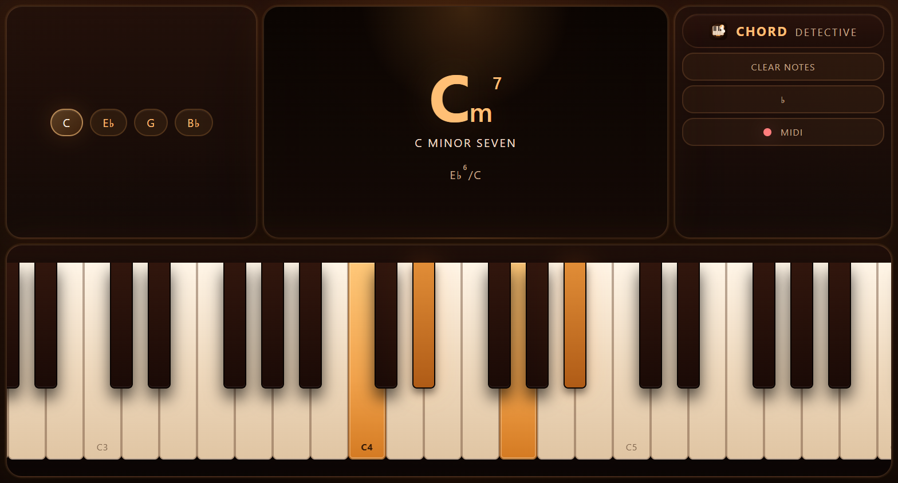

# Chord Detective

Chord Detective is a lightweight browser app for identifying chords from either the on-screen piano or a connected MIDI keyboard. It is a static site with no build step, no framework, and a landscape-first interface tuned for desktop, tablet, and phone use.

The app is also installable as a Progressive Web App (PWA), so supported browsers can add it to the home screen and reopen it like a local app shell.

## Live App

[https://danibanon.github.io/chord-detective/](https://danibanon.github.io/chord-detective/)

## Screenshots



## Features

- Real-time chord detection from on-screen notes and Web MIDI input
- Landscape-first responsive layout across desktop, tablet, and phone
- Sharp/flat display toggle for labels and detected chord names
- Alternate exact chord names when a voicing has multiple valid readings
- Omitted-fifth fallback names such as `Am7(no5)` where applicable
- Installable PWA with offline-ready app shell caching
- Touch-friendly piano panning and octave navigation on smaller screens

## Supported Chords

The built-in detector covers:

- Power chords
- Major, minor, diminished, augmented
- `sus2`, `sus4`, `7sus4`
- `6`, `m6`, `6/9`
- `7`, `maj7`, `m7`, `7b5`
- `°7`, `ø7`, `oM7`, `mM7`, `M7b5`, `+7`, `+M7`
- `9`, `maj9`, `m9`, `11`, `maj11`, `m11`, `13`, `maj13`, `m13`
- `add9`, `add11`, `add#11`, `madd9`
- `addb9`, `7b9`, `M7b9`
- `add#9`, `7#9`, `M7#9`
- `addb9b5`, `7b5b9`, `M7b5b9`
- `addb9#5`, `+7b9`, `+M7b9`
- `add#9b5`, `7b5#9`, `M7b5#9`
- `add#9#5`, `+7#9`, `+M7#9`

## How It Works

- Active manual and MIDI notes are merged and reduced to pitch classes.
- Exact interval-pattern matches are preferred.
- When no exact match exists, the app can fall back to omitted-fifth names such as `11(no5)` or `m13(no5)` for chord families with a natural fifth.
- The bass note is used to derive inversion and slash-chord display.
- When several exact names match, the app chooses the simplest display name and shows up to two alternates.

## PWA Notes

- `manifest.webmanifest` configures install metadata and landscape preference.
- `sw.js` caches the app shell for offline reopening after the first successful load.
- Runtime orientation locking is attempted where supported, with a rotated landscape fallback when it is not.

## Local Development

This repository is plain static HTML, CSS, and JavaScript.

To run it locally, serve the folder with any simple HTTP server. For example:

```powershell
python -m http.server 8000
```

Then open `http://localhost:8000`.

Notes:

- `file://` is fine for a quick visual check but not for reliable PWA or MIDI behavior.
- Web MIDI support is browser-, OS-, and hardware-dependent. Chromium-based browsers are the safest choice.

## Project Structure

```text
.
|-- docs/
|   `-- screenshots/
|-- icons/
|-- index.html
|-- manifest.webmanifest
|-- sw.js
|-- LICENSE
`-- README.md
```

- `index.html` contains the UI, styles, piano behavior, MIDI handling, and chord detection logic.
- `icons/` contains the favicon and install icons.
- `docs/screenshots/landscape.png` is the current README screenshot.

## License

MIT. See [LICENSE](./LICENSE).
