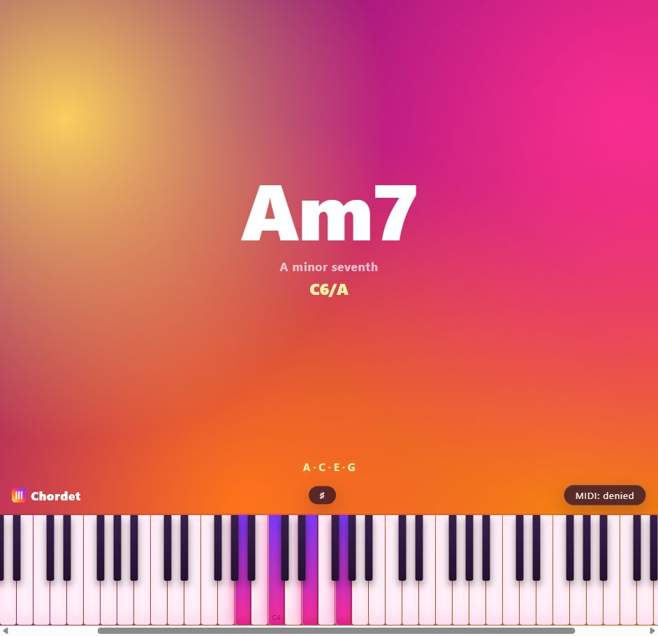

# What it does

Chordetect allows you to know the chord you are playing on your piano in 3 simple steps:
  1. Open with your phone the [website](https://danibanon.github.io/chord-detective/)
  2. Connect your piano to your phone via MIDI
  3. Enjoy!

Landscape mode is highly recommended!

## Installable App

Install Chordetect on your phone directly from the web! No play store needed
  1. Open the [URL](https://danibanon.github.io/chord-detective/) in Android Chrome
  2. Click top right 3 dots
  3. Add to home screen
  4. Install
  5. Now you have it! Go find "Chordetect" among your apps

## Design goals

- Keep the rebuild lean and easy to audit, with as few lines of code and files as practical.
- Preserve a clean Material 3-inspired visual language using a dark surface, soft violet accents, rounded containers, and elevated keys.
- Stay responsive without breakpoints-heavy layout code by scaling from viewport width and height, hiding secondary UI when vertical space gets too tight, and keeping the piano horizontally scrollable when necessary.
- Work as a no-build static site that can be opened locally or hosted from any simple web server.

## Project structure

- [`index.html`](./index.html): app UI, styling, chord detection, responsive piano rendering, and MIDI integration
- [`manifest.webmanifest`](./manifest.webmanifest): install metadata
- [`sw.js`](./sw.js): offline cache
- [`icons/logo.svg`](./icons/logo.svg): extracted logo source and app icon
- [`screenshot.png`](./screenshot.png): README preview image
